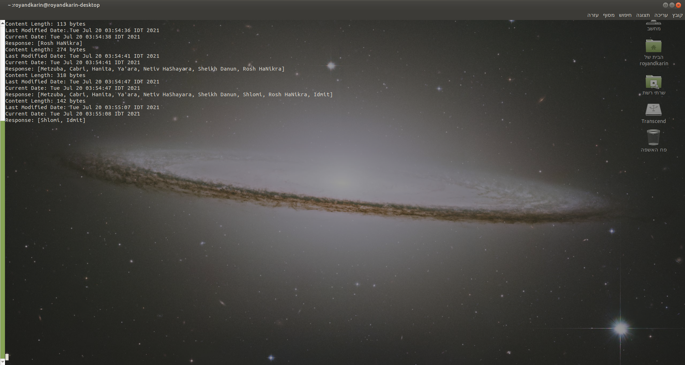
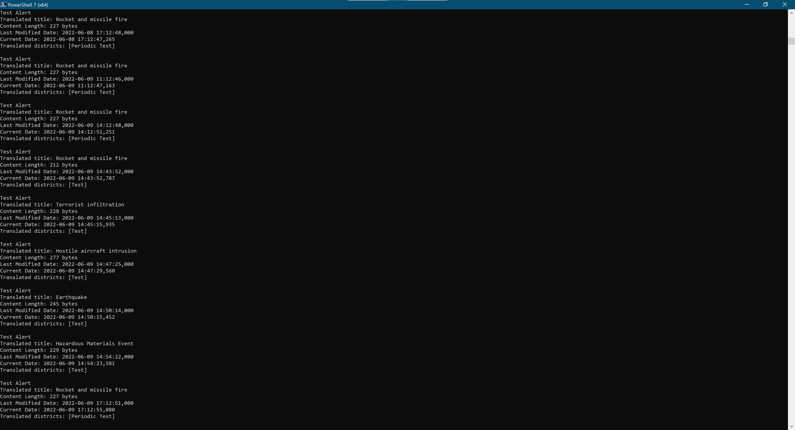
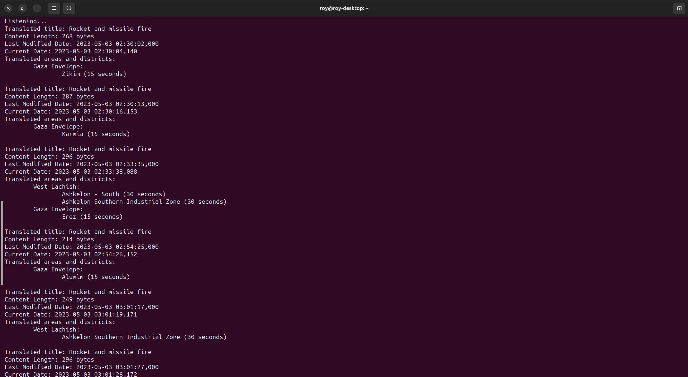
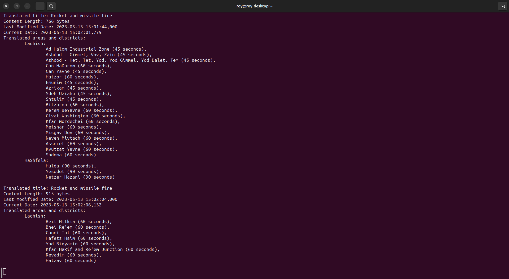

# red-alert-listener

## Requirements

1. [red-alert-listener.conf.json](red-alert-listener.conf.json) is being searched under current working directory by default (can be changed by stating the path (can be relative) to the configuration file via `-c` flag).
2. JRE 21 (or newer)
3. Must have an Israeli IP address.
4. JAR can be downloaded through `Packages → io.github.ashr123.red-alert-listener → Assets → red-alert-listener-<version>-jar-with-dependencies.jar`

## Capabilities

1. Display alerts as the Home Front Command produces them.
2. Make alert sound if the event contains areas of interest defined in [red-alert-listener.conf.json](red-alert-listener.conf.json).
3. Supports all official languages:
	- Hebrew (code `HE`)
	- English (code `EN`)
	- Russian (code `RU`)
	- Arabic (code `AR`)
4. `districts.json` (like [districts-en.json](districts-en.json "districts") example) created from `get-remote-districts-as-json-to-file` command is of the following shape (in TypeScript terms):
   ```ts
   interface District {
       translation: string;
       protectionTimeInSeconds: number;
   };

   interface AreaDistricts {
       [districtNameInHebrew: string]: District;
   };

   interface AreaData {
       [translatedAreaName: string]: AreaDistricts;
   };

   const data: AreaData = require('districts-en.json');
   ```
   
   Or in Java terms:
   ```java
   import com.fasterxml.jackson.core.type.TypeReference;
   import com.fasterxml.jackson.databind.annotation.JsonDeserialize;
   import com.fasterxml.jackson.databind.annotation.JsonSerialize;
   import com.fasterxml.jackson.databind.json.JsonMapper;
   import com.fasterxml.jackson.databind.util.StdConverter;

   import java.io.IOException;
   import java.time.Duration;

   record Districts(String translation,
                    @JsonDeserialize(converter = DurationDeserializer.class)
                    Duration protectionTimeInSeconds) { 
       private static class DurationDeserializer extends StdConverter<Long, Duration> { 
           @Override
           public Duration convert(Long value) {
               return Duration.ofSeconds(value);
           }
       }
   }

   public static void main(String... args) throws IOException {
       final Map<String /*translated area name*/,
               Map<String /*district name in Hebrew*/,
                       District>> data = new JsonMapper()
               .readValue(
                       new File("districts-en.json"),
                       new TypeReference<>() {
                       }
               );
   }
   ```

[comment]: <> (   Got it by running the following code on the DevTools console window on chrome)

[comment]: <> (   ```javascript)

[comment]: <> (   console.log&#40;JSON.stringify&#40;districts.reduce&#40;&#40;result, {label_he, label}&#41; => &#40;result[label_he] = label, result&#41;, {}&#41;&#41;&#41;)

[comment]: <> (   ```)

Legal districts (and their translation) can be found by:

1. Running `java -jar <downloaded-jar-file>.jar get-remote-districts-as-json -l <language code> | egrep -i "<district1>|<district2>[|...]"`
2. Saving those districts to file like
   this: `java -jar <downloaded-jar-file>.jar get-remote-districts-as-json-to-file -l <language code> [-o <your-file-name>.json]`
   (the default file name is `districts.json`) and search in it as you may like.

## Known bugs

- On Raspberry Pi 4 with Ubuntu 22.10, alert sound isn't working.

## Demonstration









